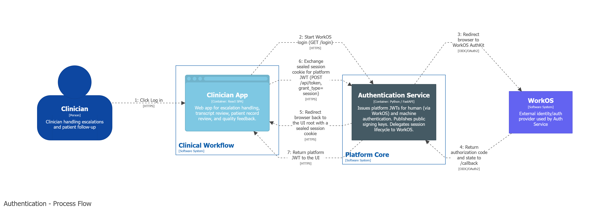
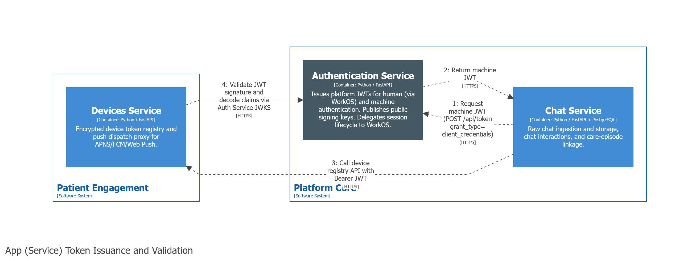
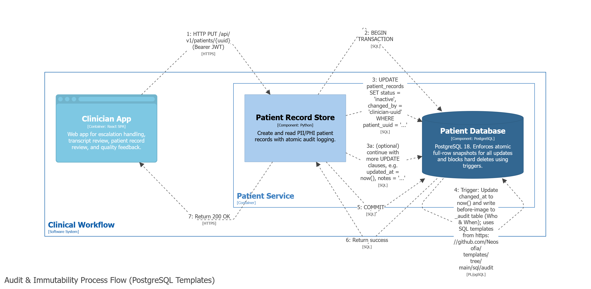
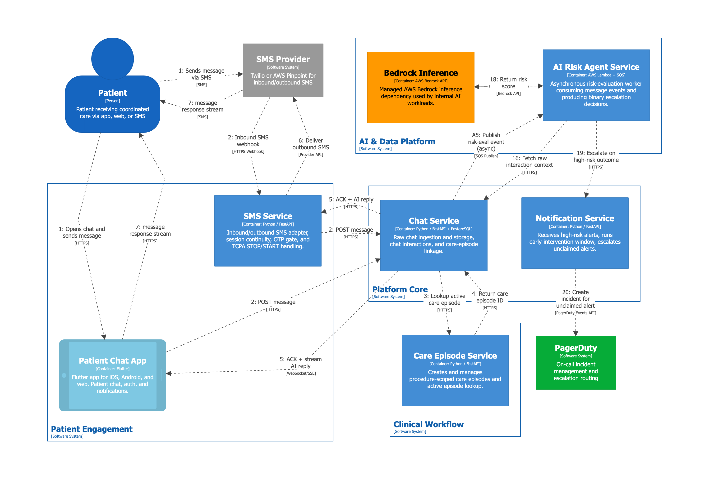
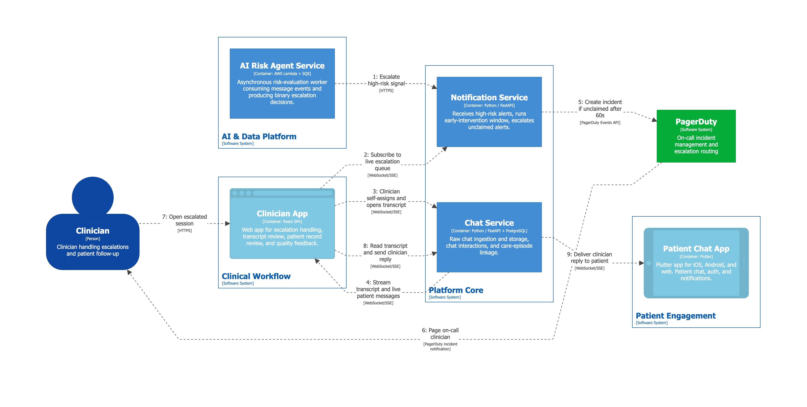
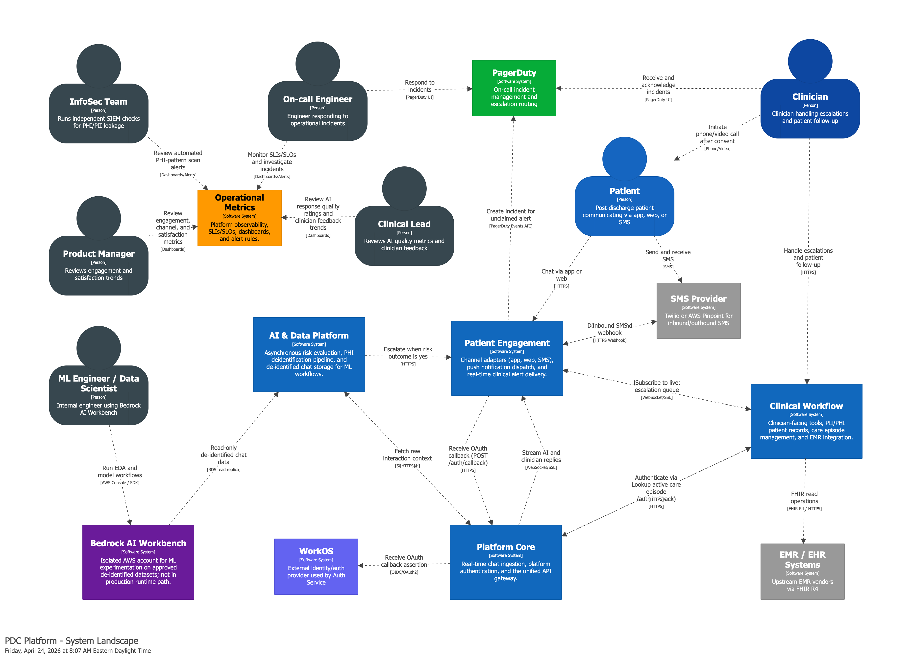

# Clinical Data Platform (CDP)

A HIPAA-compliant clinical data platform for AI-assisted care coordination, patient engagement, risk detection, and clinician escalation across SMS, web, and mobile channels.

This system is a reference architecture that leverages the suite of Neosofia platform services. It is intended to act as a starting point for other organizations looking to build their own data management platform. As a reference architecture, this system is not a drop-in substitute for a fully operational, regulatory-compliant system.

## Core Platform Capabilities

Below is an overview of how we address the foundational pillars of platforms using our SDKs, templates, services, and reference architecture (specs, ADRs, and constitution):

### Identity & Access
A central pillar for the platform, enforced through our authentication service and authorization patterns. We use the Neosofia [`authentication`](https://github.com/Neosofia/authentication) service for user identity and login flows, and implement access control with the [`authorization-in-the-middle`](https://github.com/Neosofia/sdk/tree/main/python/authorization-middleware) middleware in our [`sdk`](https://github.com/Neosofia/sdk). Service-specific Cedar policies are defined at the service level, ensuring all requests are authorized before they can access protected patient data and default to deny-all to support the principle of least privilege. Higher-level role and organization policies that control UI behavior are handled by our companion Neosofia [`capabilities`](https://github.com/Neosofia/capabilities) service, which evaluates a product-owned policy bundle for UI entitlements (see [ADR 0012](architecture/adrs/0012-ui-capabilities-control-plane.md)).

### Observability
We use standardized log schema definitions from [`schemas`](https://github.com/Neosofia/schemas) and shared logging SDKs from our [`sdk`](https://github.com/Neosofia/sdk) to enforce consistent logging and correlation across backend services, while leveraging OpenTelemetry instrumentation in the UI layer.

### Platform Delivery/Operations
Deployment, CI/CD, and environment management are codified in our [`infrastructure`](https://github.com/Neosofia/infrastructure) scripts, unified `docker-compose` setups, and documented thoroughly in an `OPERATIONS.md` for each service and component. We also support quick service onboarding with environment bootstrapping tools such as the [`authentication` env setup script](https://github.com/Neosofia/authentication/blob/main/scripts/setup-env.py) and reusable workflows (GHAs) in [`platform-workflows`](https://github.com/Neosofia/platform-workflows) for local service bootstrapping, onboarding, and runbook automation.

### Security/Secrets
Security is enforced at every layer. We use [`authorization-in-the-middle`](https://github.com/Neosofia/sdk/tree/main/python/authorization-middleware) and [`authentication-in-the-middle`](https://github.com/Neosofia/sdk/tree/main/python/authentication-middleware) from the Neosofia [`sdk`](https://github.com/Neosofia/sdk) for deterministic access control and identity, use structured logs for analysis by a SIEM system, and codify supply-chain controls through our SDLC checklist at [`corporate` SDLC checklist](https://github.com/Neosofia/corporate/blob/main/resources/checklists/sdlc.md). That checklist drives package and image pinning, lockfile verification, and automated Trivy vulnerability/secret scans in our release pipeline.

### Service Connectivity
Services are loosely coupled but firmly contracted. We rely on OpenAPI specifications from [`schemas`](https://github.com/Neosofia/schemas) to define clear boundaries, and we document integration patterns and service contracts across the CDP service family.

### Data/Storage Foundation
We use standardized PostgreSQL 18 deployments and atomic SQL audit trigger templates in [`templates`](https://github.com/Neosofia/templates). These capture every operation (Who, What, When, Why) immutably at the database layer.

### Developer Experience
We standardize and accelerate development using pre-built templates from [`templates`](https://github.com/Neosofia/templates) and shared runtime libraries from [`sdk`](https://github.com/Neosofia/sdk). This ensures new features and services can be scaffolded quickly without reinventing the wheel.

### Governance/Compliance
Technical alignment and regulatory compliance (like HIPAA) are governed by our [`architecture/constitution.md`](architecture/constitution.md), the ADR catalog in [`architecture/adrs/`](architecture/adrs/), and Spec-based service designs. These principles are supported by companion governance artifacts in [`corporate`](https://github.com/Neosofia/corporate) and the broader Neosofia repo portfolio.

## Reference Architecture Primary Workflows

The two primary workflows in this system are patient chat and clinician escalation. After signing up, patients can use a browser, the mobile chat app, or SMS to start a conversation with the AI care agent. If escalation signals are detected, on-call clinicians are notified and begin the clinician escalation workflow.

### Patient Chat Process

### Clinician Escalation/Response Process

## Architecture Diagram

The system landscape diagram below is an overview of the main system actors, major third-party vendors (PagerDuty and WorkOS), and platform services grouped by function.

> Note: An extended set of fully interactive C4 models can be viewed by downloading this repo, running `docker compose -f architecture/docker-compose.yml up -d --build`, and then opening [http://localhost:8080/workspace/1](http://localhost:8080/workspace/1). See [`architecture/OPERATIONS.md`](architecture/OPERATIONS.md) for dev vs production workflows.

### Key Components and Services

The platform is decomposed into independently deployable services, apps, and data pipelines grouped by the four domains shown in the architecture diagram above.

**Patient Engagement (WIP)** — channel adapters, push notifications, patient UI
- **[Patient Chat App (007)](specs/007-patient-chat-app.md)** — The patient-facing app for iOS, Android, and web. Patients chat with their care team, receive AI-assisted replies, and get push notifications.
- **[SMS Service (009)](specs/009-sms-service.md)** — Allows patients to participate via SMS without installing the app. Handles opt-in/opt-out compliance.
- **[Devices Service (013)](specs/013-devices-service.md)** — Manages device registrations so push notifications reach the right patient or clinician on the right device, without exposing raw tokens to other services.

**Clinical Workflow (WIP)** — clinician tools, patient records, care episodes, EMR
- **[Clinician App (008)](specs/008-clinician-app.md)** — The clinician-facing web app. Shows the live escalation queue, patient chat transcripts, EMR context, and lets clinicians take over from the AI, send replies, and rate session quality.
- **[Patient Service (012)](specs/012-patient-service.md)** — The authoritative record for patient identity. Patients are registered via invite only. Every access is audit-logged for HIPAA compliance.
- **[Care Episode Service (015)](specs/015-care-episode-service.md)** — Groups a patient, procedure, and all associated conversations into a single care episode. Answers the question "which chats belong to which procedure?" and is the root object for invites, chat history, and EMR context.
- **[EMR Service (004)](specs/004-emr-service.md)** — Provides a unified view of patient records from any connected hospital system, so clinicians see relevant clinical context alongside the chat.

**AI & Data Platform (WIP)** — risk evaluation, deidentification, clean chat store
- **[AI Risk Agent (010)](specs/010-ai-agent-service.md)** — Evaluates every patient message for clinical risk in the background without slowing down the chat. A high-risk signal triggers the clinician notification flow.
- **[Deidentification Pipeline (002)](specs/002-deidentification-pipeline.md)** — After a chat session ends, it strips all patient-identifying information so the conversation can be safely used for research and model improvement. Failed sessions are held for review, never silently passed through.
- **[Clean Chat Service (003)](specs/003-clean-chat-service.md)** — Stores de-identified chat sessions for internal analysis and model training. No raw patient data is accessible here.
- **[Bedrock AI Workbench (006)](specs/006-bedrock-ai-workbench.md)** — An isolated environment where ML engineers can experiment with de-identified data and improve the AI models. It has no connection to live patient data or production systems.

**Platform Core** — chat ingestion, authentication, API gateway
- **[Chat Service (001)](specs/001-chat-service.md)** — Receives and stores all messages across every channel, streams AI replies back to patients in real time, and triggers risk evaluation and deidentification in the background.
- **[Authentication Service (014)](specs/014-authentication-service.md)** — Verifies the identity of every user and service before any request is processed. Handles clinician SSO login, patient session management, and service-to-service trust.
- **[Authorization Service (016)](specs/016-authorization-service.md)** — The single place where access decisions are made. Every service asks "is this principal allowed to do this?" here rather than implementing its own rules. Fails closed if unavailable.
- **[Operational Metrics (011)](specs/011-operational-metrics.md)** — Collects and aggregates structured log events across the platform to provide SLI/SLO dashboards, alerting thresholds, and derived metrics without exposing PHI.
- **[Audit Infrastructure (017)](specs/017-audit-infrastructure.md)** — Ensures every service that stores patient data maintains a tamper-evident audit trail automatically, without each team needing to build it themselves.
- **[Notification Service (005)](specs/005-notification-service.md)** — When a high-risk message is detected, gives logged-in clinicians 60 seconds to self-assign before escalating to on-call via PagerDuty.

### Security Considerations

See [SECURITY.md](SECURITY.md) for platform-wide security principles covering PHI containment, identity and access, HIPAA compliance, network and transport, audit logging, and supply chain controls. Service-specific security postures (threat models, rate limits, OAuth flow detail) are documented in each service's own `SECURITY.md`.

## Operations

See [OPERATIONS.md](OPERATIONS.md) for running the full CDP stack locally or in the cloud. For the Structurizr architecture viewer (C4 diagrams, specs, ADRs), see [`architecture/OPERATIONS.md`](architecture/OPERATIONS.md).